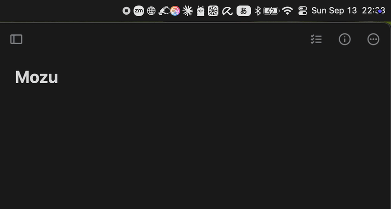
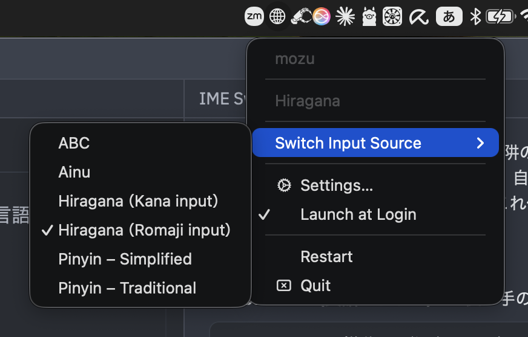
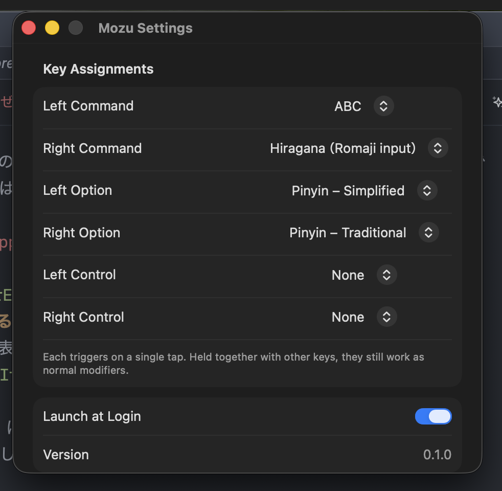

# Mozu

<p align="center">
  <a href="README.md">English</a> |
  <a href="README.ja.md">日本語</a> |
  <a href="README.zh-CN.md">简体中文</a> |
  <a href="README.zh-TW.md">繁體中文</a>
</p>

按下修饰键**一次**即可切换输入法的 macOS 菜单栏常驻应用。

JIS 键盘有专用的「假名」「英数」键，但没有任何按键可以切换到中文或其他语言。在 US 键盘上切换日语和英语的知名应用是 [eikana（英かな）](https://github.com/KS1019/eikana)，Mozu 想把同样的体验带到所有语言。

名字来自鸟类——莫兹（日本歌鸫，モズ）。它的汉字名「百舌鸟」意为“拥有百种舌头的鸟”，据说擅长模仿其他鸟的叫声。



## 设计方针（为什么不是切换式）

中文输入法一般用 Shift 在中英之间切换：中文时切到英文，英文时切回中文。
但这种来回切换必须先看清「现在是哪种语言」。
为了确认而移动视线时，注意力也跟着飞走，思路就断了。

所以 Mozu 只提供**绝对指定**：

- 松开分配键的瞬间状态就确定了（结果不受当前状态影响）
- 该输入源已被选中时，什么都不做
- 不与现有快捷键（`Cmd+C` 等）互相干扰

在输入法（日文/中文）还有未确定文字时切换语言，IME 会把未确定文字以「挂起」而不是「提交」的方式保留，之后切回同一输入法时突然冒出来，令人困惑。Mozu 为了避开这一点，会在离开输入法前**先注入一次确定键再切换**（日语用英数键，中文用 Return）。

其副作用是：从日语切走时，光标旁的指示器会**闪烁两次**（先显示 ABC，再显示目标语言）。这是有意的设计：去掉英数确定虽然只剩一次显示，但「确定未完成就切换」的竞态会复活，后台残留的 bug 也会回来。我们选择了数据而不是外观。

## 安装

### Homebrew（本仓库本身就是 tap）

```sh
brew tap nicokinu/mozu https://github.com/nicokinu/mozu.git
brew install mozu
open "$(brew --prefix mozu)/Mozu.app"
```

formula 在你自己的机器上构建（SwiftPM 零依赖，构建也不需要网络），产物不带 quarantine 标记，可以正常打开。

### zip（GitHub Releases）

从 Releases 页面下载 `Mozu-vX.Y.Z.zip`，把 `Mozu.app` 拖到 `/Applications`。

采用 ad-hoc 签名，浏览器下载后首次双击会提示「无法打开，来自身份不明的开发者」。两种方式任选其一：

- 在 Finder 中**右键 → 打开**（仅第一次）
- 终端执行 `xattr -dr com.apple.quarantine /Applications/Mozu.app`

brew 版和 zip 版的 bundle id 与 designated requirement 相同，macOS 视为同一个应用，互换版本权限依然保留。

## 所需权限（两项都必须）

| 权限 | 作用 |
|---|---|
| 输入监控 | 检测按键。没有它，打字内容会无声地不可见 |
| 辅助功能 | 建立事件 tap、注入确定键（英数/假名/Return） |

⚠️ **「输入监控」不会弹出授权对话框。** 在设置窗口点「授予…」会打开系统设置，请**手动打开** Mozu 的开关。只给辅助功能时，切换本身还能用，只有「转换中确定」会无声坏掉——这种坏法最难察觉，所以 Mozu 要两项都齐了才开始监听。

## 首次启动

1. 菜单栏图标 → **设置…**
2. 「状态」里授予**辅助功能**和**输入监控**
3. 「按键分配」里为每个键选择输入源
4. 打开**登录时启动**

菜单里没有任何输入源时，请先到「系统设置 → 键盘 → 输入法」添加你要使用的语言（`TISSelectInputSource` 只能选择已添加的输入源）。

### 分配示例

```
左 Command  → 英语 (ABC)
右 Command  → 日语 (平假名)
左 Option   → 简体中文 (拼音)
右 Option   → 繁体中文 (注音/拼音)
左/右 Control → （备用槽位）
```

分配可以在菜单里自由更改。

<p float="left">
  
  
</p>

不同的输入源有时会使用相同显示名（如 Kotoeri（ことえり）的罗马字输入和假名输入都叫「平假名」）。这时 Mozu 会自动附加后缀加以区分（`平假名（罗马字输入）` / `平假名（假名输入）`）。

## 疑难排解

系统设置里的开关明明是 ON，Mozu 的行为却像未授权：

```sh
tccutil reset Accessibility com.nico.mozu
tccutil reset ListenEvent com.nico.mozu   # 输入监控
```

执行后重新授予两项权限。普通重新构建**不会**使权限失效（签名中内嵌了不依赖二进制哈希的 designated requirement，详见 [docs/DESIGN.md](docs/DESIGN.md)，日文文档）。

## 构建

```sh
./Scripts/build-app.sh
open build/Mozu.app
```

`swift build` 也能做调试构建，但要作为菜单栏常驻应用正常工作，需要 `.app` 包（`LSUIElement` 与稳定的 bundle id）。

## 界面语言

界面支持 **ja / en / zh-Hans / zh-Hant 四种**。开发语言设为 `en`，未知语言环境会回退到英语。

## 为什么是这种设计

与英かな的差异、未确定文字挂起机制、事件 tap 的层级、TCC 的识别方式、菜单栏用 AppKit 的理由、发布流程等，都写在 [docs/DESIGN.md](docs/DESIGN.md)（日文）。
